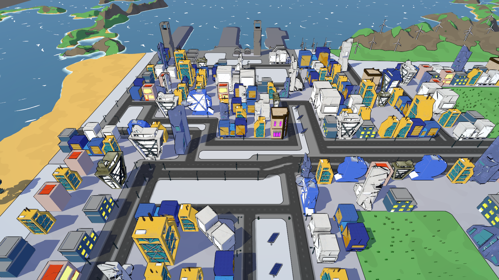
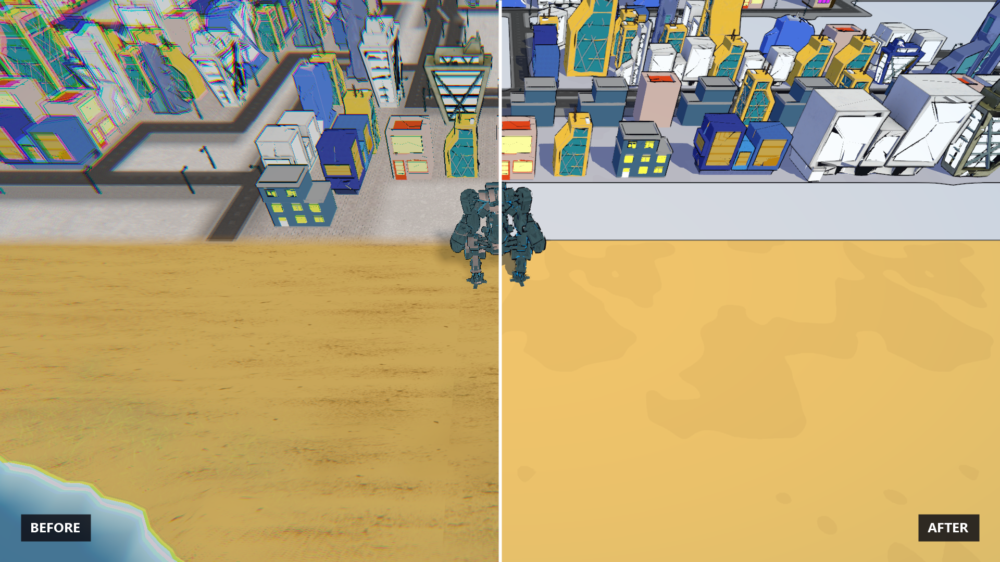
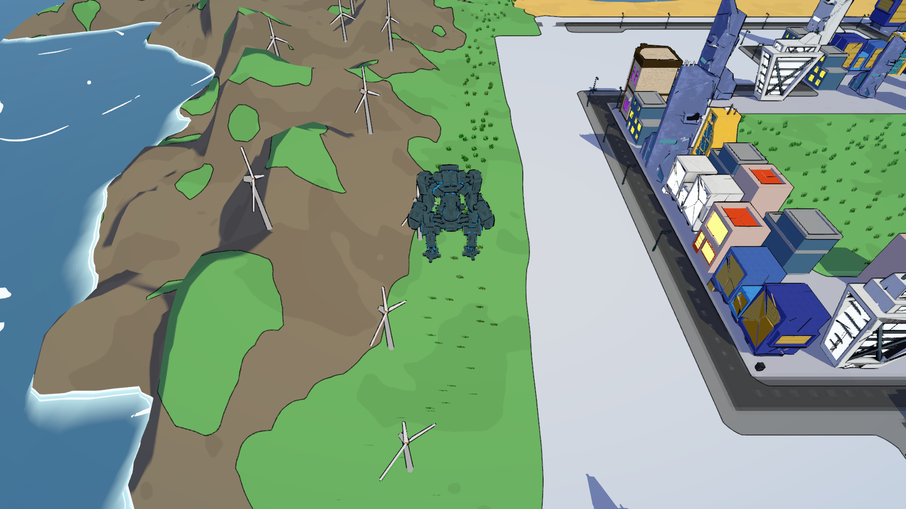
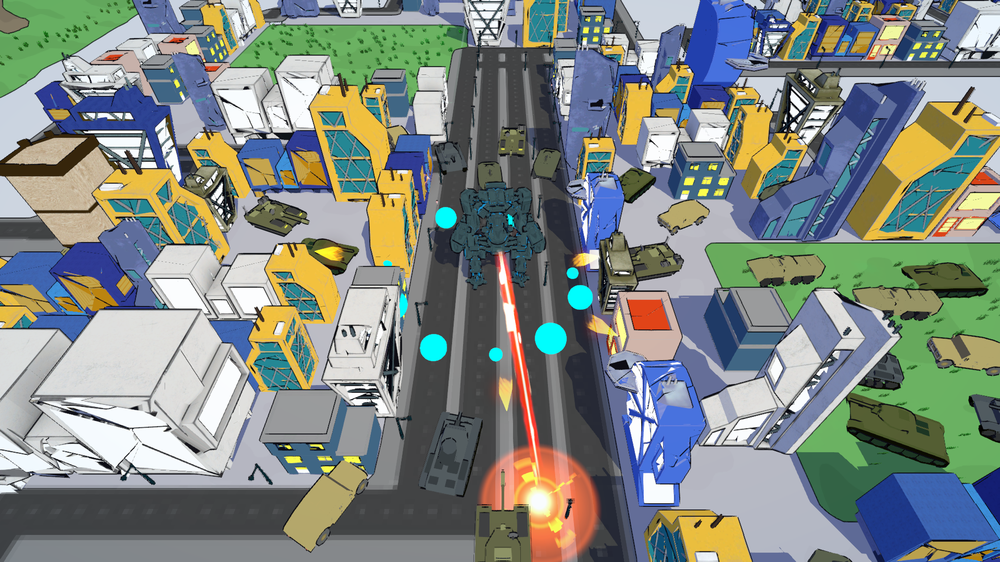
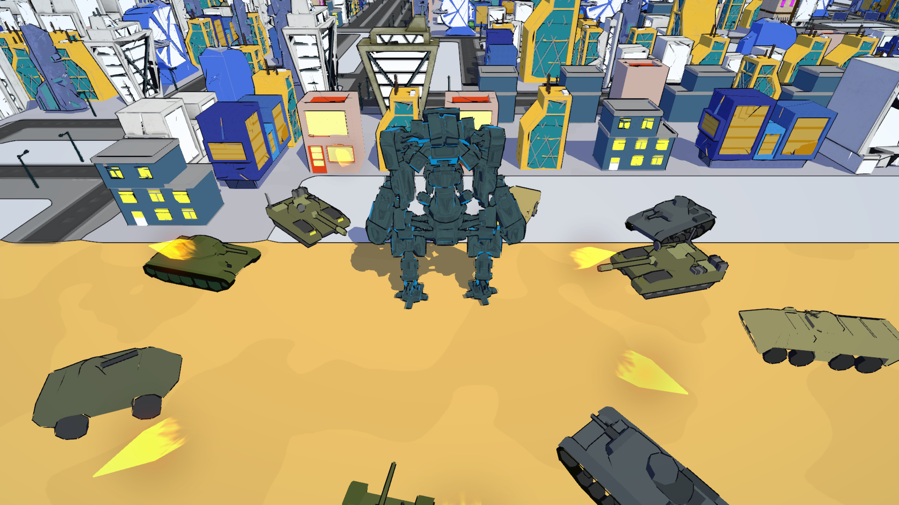
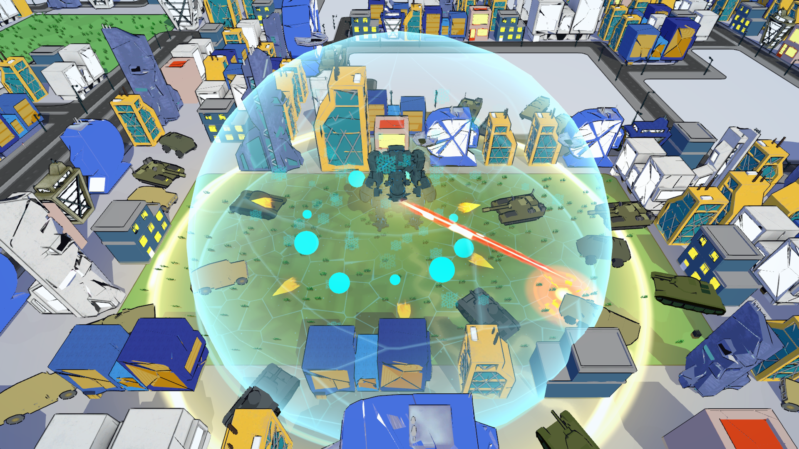

# manners.exe — Dev Log #2: A New Look

October 3, 2026

It has been four weeks since the alpha demo. Most of that time went into one thing: how the game looks. The city had new buildings, but the ground under them was a flat painted plane and nothing on screen really belonged together. Now it does.

## One style for everything

manners.exe is now a toon game, top to bottom. Flat colors, two tones of light and black ink lines. We wrote our own shaders for it, so the buildings, the ground, the mech and the horde all follow the same rules. If it is on screen, it is drawn the same way.

## The ground is not a painting anymore

This was the part that bothered us the most. The floor was a flat painted plane, and next to the new buildings it looked like it came from a different game. Now every surface has its own flat color: sand, grass, rock, street, sidewalk. An ink line separates them, the hills have a lit side and a shaded side, and the sand and the grass carry a soft pattern so they do not read as empty.

## Shadows that stay put

Buildings now cast flat blue shadows across the streets, always in the same direction. The mech has one too. They are not real-time shadows. They are simple flat shapes, which is exactly what this style asks for. When a building falls, its shadow goes with it.

## The mech and the horde

The player and all six enemy types of Level 1 got the same treatment: flat shading and an outline, so you can pick them out against the city at a glance. The mech keeps a thin blue rim light. It is the one thing on screen that should never get lost.

## A cleaner picture

- Chromatic aberration is gone. It was smearing every outline near the edges of the screen.
- Colors are no longer washed out by tonemapping. What we paint is what you see.
- Anti-aliasing is on, so the ink lines stay smooth.
- The three overrides were retuned for the new look: less glare, and a thicker laser beam.

## Synergies are now overrides

Same idea, new name. And they remember you now. Every override you discover stays discovered between runs, and a new collection panel in the main menu and on the Game Over screen shows what you have found so far. The ones you have not found are still a question mark.

## Also new

- A graphics menu, in Options and in Pause: presets, FPS limit, render scale, texture detail, shadows, outlines and more. If your laptop struggles, start there.
- The edge of the map is no longer invisible. Get close and a red holographic warning lights up before you hit the wall.
- The robot that walks you through the tutorial is animated now.
- More building variations and new street props.

## Under the hood

The new ground shader does in one pass what the old one needed two for. Real-time shadow maps are gone completely. The game also idles when you are not playing: 30 FPS in menus and pause, 15 when the window loses focus. Outlines and shadows are the most expensive parts of the new look, so each one has its own switch in the graphics menu.

## What is next

Level 1, and only Level 1. We want it to look, read and run right before we touch anything else, so Level 2 is on hold until then.

Thanks for playing.

- Francisco Peralta | Dev
